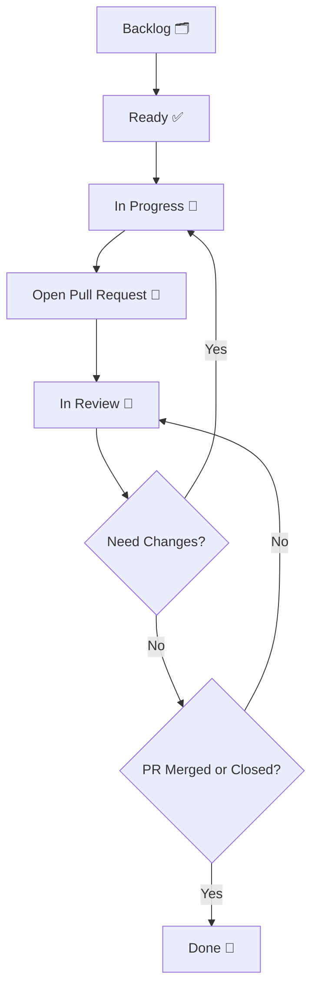

# 🚀 Alur Kontribusi – stadata_flutter_sdk

Selamat datang di dokumentasi alur kontribusi **stadata_flutter_sdk**! Dokumen ini bertujuan memudahkan kolaborasi, tracking, dan memastikan setiap kontribusi berjalan lancar, mulai dari perencanaan hingga PR di-merge.

---

## 🧭 Status Task

| Status           | Kapan digunakan                                      | Contoh Penggunaan            |
| ---------------- | ---------------------------------------------------- | ---------------------------- |
| **Backlog**      | Fitur/bug belum dijadwalkan atau masih ide.          | "Tambahkan dark mode"        |
| **Ready**        | Task sudah diprioritaskan dan siap dikerjakan.       | "Fix typo pada README"       |
| **In Progress**  | Developer sedang mengerjakan task.                   | "Implementasi API endpoint"  |
| **Open PR**      | Implementasi selesai, PR dibuka.                     | "PR #42: Add search feature" |
| **In Review**    | PR sedang direview oleh codeowner/maintainer.        | "Review oleh @maintainer"    |
| **Need Changes** | PR diminta diperbaiki, kembali ke tahap In Progress. | "Perbaiki test yang gagal"   |
| **Done**         | PR sudah di-merge atau ditutup (closed).             | "Fitur sudah live"           |

---

## 🔄 Alur Workflow Kontribusi



**Penjelasan:**  
Setiap task dimulai dari Backlog, diprioritaskan ke Ready, dikerjakan (In Progress), lalu dibuka PR-nya. Setelah direview, jika perlu revisi kembali ke In Progress, jika sudah OK dan PR di-merge, status menjadi Done.

---

## 📝 Format Standar Task (Opsional)

```markdown
📌 Judul: Tambah fitur search pada StadataView
👤 Assignee: @username (opsional)
📂 Branch: feature/search-stadata-view (wajib)
🏷️ Status: In Progress (wajib)
📈 Story Point: 3 (opsional)
🔥 Priority: P1 (opsional)
📬 PR: #42 (diisi saat PR sudah dibuat)
```

---

## 📊 Story Point & Prioritas

| Story Point | Estimasi Effort |
| ----------- | --------------- |
| 1           | Sangat ringan   |
| 2           | Ringan          |
| 3           | Sedang          |
| 4           | Kompleks        |
| 5           | Sangat kompleks |

> **Tips:**  
> Tentukan story point berdasarkan kompleksitas, bukan hanya waktu pengerjaan.

| Prioritas | Keterangan                       |
| --------- | -------------------------------- |
| **P0**    | Wajib segera dikerjakan (urgent) |
| **P1**    | Prioritas tinggi                 |
| **P2**    | Prioritas menengah               |
| **P3**    | Nice to have / dapat ditunda     |

---

## 🛠️ Tools & Automation

- Gunakan GitHub Projects untuk otomatisasi status.
- Gunakan `CODEOWNERS` untuk assign reviewer otomatis.
- Gunakan CI/CD (misal: GitHub Actions, Bitrise) untuk validasi PR otomatis.

---

## 👏 Selamat Berkontribusi

Jangan ragu bertanya jika ada yang kurang jelas. Setiap kontribusi kamu sangat berarti bagi komunitas!
