# 🚀 Alur Kontribusi – stadata_flutter_sdk

Selamat datang di alur kontribusi **stadata_flutter_sdk**! Dokumen ini bertujuan untuk mempermudah kolaborasi dan pelacakan, memastikan setiap kontribusi berjalan lancar dari perencanaan hingga merge PR.

---

## 🧭 Status Task

| Status           | Kapan Digunakan                                        | Contoh Penggunaan            |
| ---------------- | ------------------------------------------------------ | ---------------------------- |
| **Backlog**      | Fitur/bug belum dijadwalkan atau masih sebatas ide.   | "Tambah dark mode"           |
| **Ready**        | Task sudah diprioritaskan dan siap dikerjakan.        | "Fix typo di README"         |
| **In Progress**  | Developer sedang mengerjakan task.                    | "Implement API endpoint"     |
| **Open PR**      | Implementasi selesai, PR sudah dibuka.                | "PR #42: Add search feature" |
| **In Review**    | PR sedang di-review oleh codeowner/maintainer.        | "Review by @maintainer"      |
| **Need Changes** | PR butuh revisi, kembali ke In Progress.              | "Fix failing tests"          |
| **Done**         | PR sudah di-merge atau ditutup.                       | "Feature sudah live"         |

---

## 🔄 Alur Kontribusi

```mermaid
flowchart TD
  A[Backlog 🗂️] --> B[Ready ✅]
  B --> C[In Progress 🔧]
  C --> D[Open Pull Request 🔁]
  D --> E[In Review 👀]
  E --> F{Need Changes?}
  F -- Ya --> C
  F -- Tidak --> G{PR Merged atau Closed?}
  G -- Ya --> H[Done 🎉]
  G -- Tidak --> E
```



**Penjelasan:**  
Setiap task dimulai dari Backlog, pindah ke Ready, dikerjakan (In Progress), lalu PR dibuka. Setelah review, jika butuh revisi kembali ke In Progress, jika disetujui dan di-merge, status menjadi Done.

---

## 📝 Format Task Standar (Opsional)

```markdown
📌 Title: Add search feature to StadataView
👤 Assignee: @username (opsional)
📂 Branch: feature/search-stadata-view (wajib)
🏷️ Status: In Progress (wajib)
📈 Story Point: 3 (opsional)
🔥 Priority: P1 (opsional)
📬 PR: #42 (isi setelah PR dibuat)
```

---

## 📊 Story Point & Priority

| Story Point | Estimasi Effort |
| ----------- | --------------- |
| 1           | Sangat ringan   |
| 2           | Ringan          |
| 3           | Sedang          |
| 4           | Kompleks        |
| 5           | Sangat kompleks |

> **Tips:**  
> Assign story point berdasarkan kompleksitas, bukan sekedar waktu yang dibutuhkan.

| Priority | Deskripsi                                |
| -------- | ---------------------------------------- |
| **P0**   | Harus dikerjakan segera (urgent)         |
| **P1**   | High priority                            |
| **P2**   | Medium priority                          |
| **P3**   | Nice to have / bisa ditunda              |

---

## 🛠️ Tools & Automation

- Gunakan GitHub Projects untuk automasi status.
- Gunakan `CODEOWNERS` untuk auto-assign reviewer.
- Gunakan CI/CD (misal GitHub Actions, Bitrise) untuk validasi PR otomatis.

---

## 📋 Template Issue

Gunakan template issue yang sesuai saat membuat issue baru:

### 🐛 Bug Report
```markdown
**Deskripsi Bug**
Deskripsi yang jelas dan ringkas tentang apa bugnya.

**Cara Reproduksi**
Langkah-langkah untuk mereproduksi behavior:
1. Pergi ke '...'
2. Klik pada '....'
3. Scroll down ke '....'
4. Lihat error

**Expected Behavior**
Deskripsi yang jelas dan ringkas tentang apa yang diharapkan terjadi.

**Screenshots**
Jika berlaku, tambahkan screenshot untuk membantu menjelaskan masalah Anda.

**Environment:**
- OS: [e.g. iOS 17, Android 14]
- Flutter Version: [e.g. 3.16.0]
- Package Version: [e.g. 1.0.0]
```

### ✨ Feature Request
```markdown
**Apakah feature request Anda terkait dengan masalah? Silakan jelaskan.**
Deskripsi yang jelas dan ringkas tentang apa masalahnya.

**Jelaskan solusi yang Anda inginkan**
Deskripsi yang jelas dan ringkas tentang apa yang Anda inginkan terjadi.

**Jelaskan alternatif yang telah Anda pertimbangkan**
Deskripsi yang jelas dan ringkas tentang solusi atau fitur alternatif yang telah Anda pertimbangkan.

**Konteks tambahan**
Tambahkan konteks atau screenshot lain tentang feature request di sini.
```

---

## 🎯 Checklist Kontribusi

### Sebelum Memulai
- [ ] Baca [Panduan Kontribusi](CONTRIBUTING.md)
- [ ] Pilih issue atau buat yang baru
- [ ] Diskusikan pendekatan dalam issue
- [ ] Fork repository dan setup lokal

### Selama Development
- [ ] Ikuti [Clean Architecture](CLAUDE.md)
- [ ] Tulis test untuk perubahan
- [ ] Update dokumentasi jika diperlukan
- [ ] Test di example app
- [ ] Jalankan `melos format` dan `melos analyze`

### Sebelum Submit PR
- [ ] Semua test lulus
- [ ] Test coverage cukup
- [ ] Example app berjalan dengan baik
- [ ] Dokumentasi up-to-date
- [ ] Commit message mengikuti konvensi
- [ ] Squash commit jika diperlukan

### Setelah Submit PR
- [ ] Tanggapi feedback review
- [ ] Update PR jika ada perubahan yang diminta
- [ ] Merge setelah approval

---

## 👏 Happy Contributing

Jangan ragu untuk bertanya jika ada yang tidak jelas. Setiap kontribusi yang Anda berikan sangat berharga untuk komunitas!

### 🤝 Mari Membangun Bersama

STADATA Flutter SDK adalah proyek open source yang tumbuh dengan kontribusi dari komunitas. Bersama-sama kita bisa menciptakan tool yang lebih baik untuk mengakses data statistik Indonesia.

**Terima kasih telah menjadi bagian dari komunitas ini!** 🙏