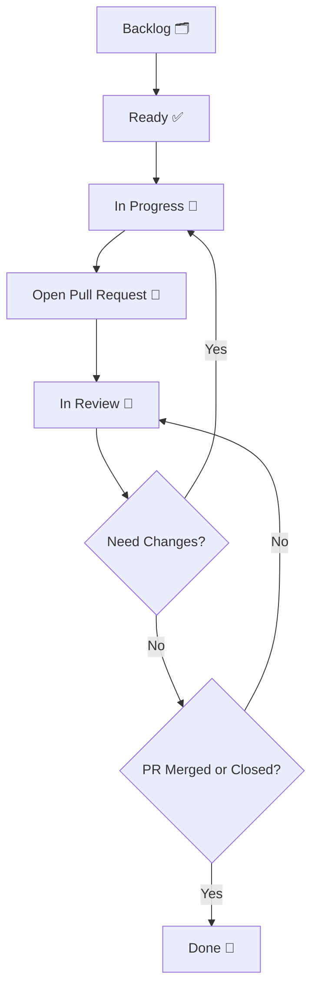

# 🚀 Contribution Workflow – stadata_flutter_sdk

Welcome to the **stadata_flutter_sdk** contribution workflow! This document aims to make collaboration and tracking easier, ensuring every contribution runs smoothly from planning to PR merge.

---

## 🧭 Task Status

| Status           | When to Use                                        | Example Usage                |
| ---------------- | -------------------------------------------------- | ---------------------------- |
| **Backlog**      | Feature/bug not yet scheduled or still an idea.    | "Add dark mode"              |
| **Ready**        | Task has been prioritized and is ready to work on. | "Fix typo in README"         |
| **In Progress**  | Developer is currently working on the task.        | "Implement API endpoint"     |
| **Open PR**      | Implementation done, PR is opened.                 | "PR #42: Add search feature" |
| **In Review**    | PR is being reviewed by codeowner/maintainer.      | "Review by @maintainer"      |
| **Need Changes** | PR needs revision, goes back to In Progress.       | "Fix failing tests"          |
| **Done**         | PR has been merged or closed.                      | "Feature is live"            |

---

## 🔄 Contribution Workflow



**Explanation:**  
Each task starts from Backlog, moves to Ready, is worked on (In Progress), then a PR is opened. After review, if revisions are needed it goes back to In Progress, if approved and merged, the status becomes Done.

---

## 📝 Standard Task Format (Optional)

```markdown
📌 Title: Add search feature to StadataView
👤 Assignee: @username (optional)
📂 Branch: feature/search-stadata-view (required)
🏷️ Status: In Progress (required)
📈 Story Point: 3 (optional)
🔥 Priority: P1 (optional)
📬 PR: #42 (fill after PR is created)
```

---

## 📊 Story Point & Priority

| Story Point | Estimated Effort |
| ----------- | ---------------- |
| 1           | Very light       |
| 2           | Light            |
| 3           | Medium           |
| 4           | Complex          |
| 5           | Very complex     |

> **Tips:**  
> Assign story points based on complexity, not just time required.

| Priority | Description                       |
| -------- | --------------------------------- |
| **P0**   | Must be done immediately (urgent) |
| **P1**   | High priority                     |
| **P2**   | Medium priority                   |
| **P3**   | Nice to have / can be postponed   |

---

## 🛠️ Tools & Automation

- Use GitHub Projects for status automation.
- Use `CODEOWNERS` to auto-assign reviewers.
- Use CI/CD (e.g., GitHub Actions, Bitrise) for automatic PR validation.

---

## 👏 Happy Contributing

Don't hesitate to ask if anything is unclear. Every contribution you make is valuable to the community!
