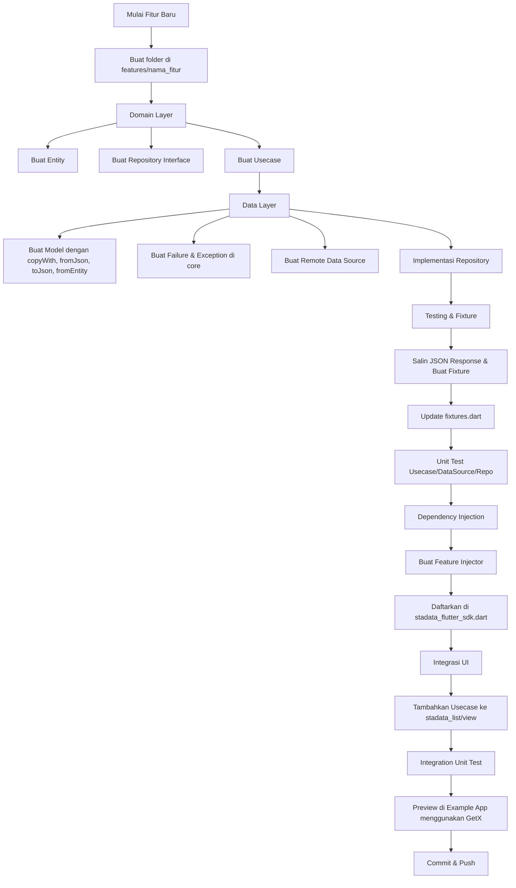

# 🚀 Panduan Pengembangan Fitur

Panduan ini menjelaskan langkah-langkah sistematis untuk mengembangkan fitur baru dalam proyek **stadata_flutter_sdk**.

---

## 🔄 Alur Pengembangan Fitur

1. **Buat Folder Fitur**

   - Buat folder baru di `features/nama_fitur`.

2. **Domain Layer**

   - Buat entity yang diperlukan.
   - Buat interface repository untuk fitur tersebut.
   - Buat usecase yang merepresentasikan logika bisnis.

3. **Data Layer**

   - Buat model untuk entity (harus memiliki: `copyWith`, `fromJson`, `toJson`, `fromEntity`).
   - Buat kelas failure & exception terkait di folder `core`.
   - Buat remote data source.
   - Implementasikan repository.

4. **Testing & Fixture**

   - Salin contoh response JSON, buat fixture `.json` di `test/fixture`.
   - Tambahkan enum baru di `fixtures.dart` dan nama file fixture.
   - Tulis unit test untuk usecase, data source, dan repository (opsional tapi direkomendasikan).

5. **Dependency Injection**

   - Buat injector untuk fitur dan inject file-file yang diperlukan.
   - Daftarkan injector di `stadata_flutter_sdk.dart`.

6. **Integrasi UI**

   - Tambahkan usecase ke `stadata_list` (untuk list) atau `stadata_view` (untuk detail).
   - Tulis unit test untuk integrasi.
   - Buat halaman preview untuk penggunaan di example app (menggunakan GetX).

7. **Commit & Push**
   - Commit perubahan Anda dan push ke repository.

---

## 🗺️ Diagram Alur Kerja



---

## 📌 Tips

- Selalu mulai dari domain layer untuk memastikan logika bisnis yang jelas.
- Pastikan semua model memiliki method `copyWith`, `fromJson`, `toJson`, dan `fromEntity`.
- Unit test sangat direkomendasikan untuk setiap layer.
- Gunakan fixture untuk menyederhanakan testing dan mendokumentasikan response API.
- Preview di example app membantu validasi end-to-end sebelum merge.

---

## 🏗️ Struktur Folder yang Direkomendasikan

```
lib/src/features/nama_fitur/
├── domain/
│   ├── entities/
│   │   ├── entities.dart (barrel file)
│   │   └── nama_fitur.dart
│   ├── repositories/
│   │   └── nama_fitur_repository.dart
│   └── usecases/
│       └── get_nama_fitur.dart
├── data/
│   ├── datasources/
│   │   └── nama_fitur_remote_data_source.dart
│   ├── models/
│   │   └── nama_fitur_model.dart
│   └── repositories/
│       └── nama_fitur_repository_impl.dart
└── injector/
    └── nama_fitur_injector.dart
```

---

## 🧪 Template Testing

### Entity Test

```dart
group('NamaFiturEntity', () {
  test('should support value equality', () {
    // Test equality dan props
  });
});
```

### Model Test

```dart
group('NamaFiturModel', () {
  test('fromJson should return valid model', () {
    // Test deserialization
  });
  
  test('toJson should return valid JSON', () {
    // Test serialization
  });
  
  test('copyWith should return updated model', () {
    // Test copyWith method
  });
});
```

### Repository Test

```dart
group('NamaFiturRepository', () {
  test('should return list when call is successful', () {
    // Test success case
  });
  
  test('should return failure when call is unsuccessful', () {
    // Test failure case
  });
});
```

---

## 🚀 Checklist Pengembangan Fitur

- [ ] ✅ Entity dibuat dengan extends BaseEntity
- [ ] ✅ Repository interface didefinisikan
- [ ] ✅ Usecase menggunakan Result pattern
- [ ] ✅ Model memiliki fromJson, toJson, copyWith, fromEntity
- [ ] ✅ Exception dan Failure class dibuat
- [ ] ✅ Remote data source diimplementasi
- [ ] ✅ Repository implementation menggunakan Result pattern
- [ ] ✅ Fixture JSON tersedia
- [ ] ✅ Unit tests ditulis untuk semua layer
- [ ] ✅ Injector dibuat dan didaftarkan
- [ ] ✅ Integrasi ke StadataList/StadataView
- [ ] ✅ Example app diperbarui
- [ ] ✅ Documentation diperbarui

---

Selamat mengembangkan fitur! 🚀