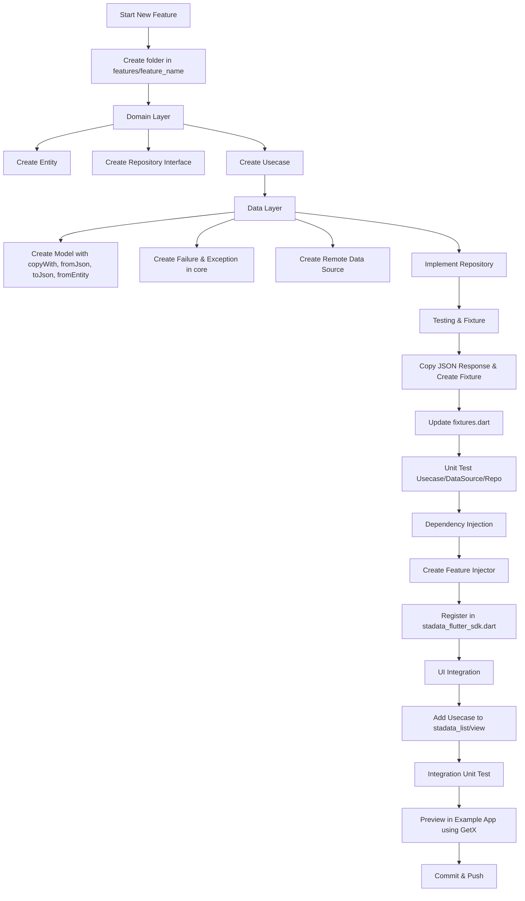

# 🚀 Feature Development Workflow

This guide describes the systematic steps for developing a new feature in the **stadata_flutter_sdk** project.

---

## 🔄 Feature Development Flow

1. **Create Feature Folder**

   - Create a new folder in `features/feature_name`.

2. **Domain Layer**

   - Create the required entity.
   - Create a repository interface for the feature.
   - Create usecases representing the business logic.

3. **Data Layer**

   - Create a model for the entity (must have: `copyWith`, `fromJson`, `toJson`, `fromEntity`).
   - Create related failure & exception classes in the `core` folder.
   - Create a remote data source.
   - Implement the repository.

4. **Testing & Fixture**

   - Copy the example JSON response, create a `.json` fixture in `test/fixture`.
   - Add a new enum in `fixtures.dart` and the fixture file name.
   - Write unit tests for usecase, data source, and repository (optional but recommended).

5. **Dependency Injection**

   - Create an injector for the feature and inject the required files.
   - Register the injector in `stadata_flutter_sdk.dart`.

6. **UI Integration**

   - Add the usecase to `stadata_list` (for list) or `stadata_view` (for detail).
   - Write unit tests for the integration.
   - Create a preview page for usage in the example app (using GetX).

7. **Commit & Push**
   - Commit your changes and push to the repository.

---

## 🗺️ Workflow Diagram

---

## 📌 Tips

- Always start from the domain layer to ensure clear business logic.
- Make sure all models have `copyWith`, `fromJson`, `toJson`, and `fromEntity` methods.
- Unit tests are highly recommended for each layer.
- Use fixtures to simplify testing and document API responses.
- Preview in the example app helps validate end-to-end before merging.

---

Happy feature development! 🚀
