# 🚦 GitHub Contribution Workflow

Berikut adalah alur kontribusi standar di repository ini. Ikuti langkah-langkah berikut untuk memastikan proses kontribusi berjalan lancar dan kolaboratif.

---

## 🔄 Alur Kontribusi

```mermaid
flowchart TD
    A([Start])
    B[Temukan issue atau ide kontribusi]
    C[Fork repository]
    D[Clone ke lokal]
    E[Buat branch baru dari develop]
    F[Lakukan development & testing]
    G[Tambahkan path ke CODEOWNERS jika perlu]
    H[Update dokumentasi jika perlu]
    I[Update example_app untuk preview fitur]
    J[Commit & push ke repo fork]
    K[Buat Pull Request ke repo utama]
    L[Menunggu review & CI check]
    M{Approved?}
    N[Pull Request di-merge]
    O[Perbaiki sesuai feedback]
    P([Selesai 🎉])

    A --> B
    B --> C
    C --> D
    D --> E
    E --> F
    F --> G
    G --> H
    H --> I
    I --> J
    J --> K
    K --> L
    L --> M
    M -- Ya --> N
    N --> P
    M -- Tidak --> O
    O --> J
```

---

## 📌 Tips Kontribusi

- Diskusikan issue/ide sebelum mulai kerja.
- Selalu buat branch dari `develop` dan pastikan up-to-date.
- Update dokumentasi & contoh penggunaan jika ada perubahan fitur.
- Sertakan test pada setiap perubahan.
- Pastikan CI pipeline hijau sebelum meminta review.
- Lakukan revisi jika ada feedback dari reviewer.

Selamat berkontribusi! 🚀
