# 🚦 Alur Kontribusi GitHub

Ini adalah alur kontribusi standar untuk repository ini. Silakan ikuti langkah-langkah berikut untuk memastikan proses kontribusi yang lancar dan kolaboratif.

---

## 🔄 Alur Kontribusi

```mermaid
flowchart TD
    A([Mulai])
    B[Temukan issue atau ide kontribusi]
    C[Fork repository]
    D[Clone ke mesin lokal]
    E[Buat branch baru dari develop]
    F[Lakukan development & testing]
    G[Tambahkan path ke CODEOWNERS jika diperlukan]
    H[Update dokumentasi jika diperlukan]
    I[Update example_app untuk preview fitur]
    J[Commit & push ke forked repo]
    K[Buat Pull Request ke main repo]
    L[Tunggu review & CI check]
    M{Disetujui?}
    N[Pull Request di-merge]
    O[Revisi sesuai feedback]
    P([Selesai 🎉])

    A --> B
    B --> C
    C --> D
    D --> E
    E --> F
    F --> G
    G --> H
    H --> I
    I --> J
    J --> K
    K --> L
    L --> M
    M -- Ya --> N
    N --> P
    M -- Tidak --> O
    O --> J
```



---

## 📋 Langkah-langkah Detail

### 1. 🔍 Persiapan

**Temukan Issue atau Ide Kontribusi**

- Cek [Issues](https://github.com/ryanaidilp/stadata_flutter_sdk/issues) yang tersedia
- Lihat label [`good first issue`](https://github.com/ryanaidilp/stadata_flutter_sdk/labels/good%20first%20issue) untuk pemula
- Atau buat issue baru untuk ide Anda

### 2. 🍴 Setup Repository

**Fork dan Clone**

```bash
# Fork repository di GitHub, lalu clone
git clone https://github.com/username-anda/stadata_flutter_sdk.git
cd stadata_flutter_sdk

# Tambahkan upstream remote
git remote add upstream https://github.com/ryanaidilp/stadata_flutter_sdk.git
```

### 3. 🌿 Branching

**Buat Branch Baru**

```bash
# Update branch develop
git checkout develop
git pull upstream develop

# Buat branch fitur baru
git checkout -b feature/nama-fitur-anda
```

**Konvensi Penamaan Branch:**

- `feature/nama-fitur` - untuk fitur baru
- `fix/nama-bug` - untuk perbaikan bug
- `docs/topik` - untuk update dokumentasi
- `test/nama-test` - untuk menambah test

### 4. 🛠️ Development

**Lakukan Perubahan**

- Ikuti [Panduan Pengembangan Fitur](FEATURE_DEVELOPMENT_WORKFLOW.md)
- Pastikan kode mengikuti [Clean Architecture](CLAUDE.md)
- Tulis test untuk setiap perubahan
- Update example app jika diperlukan

**Testing Lokal**

```bash
# Jalankan semua test
melos test

# Format kode
melos format

# Analisis kode
melos analyze

# Build contoh aplikasi
cd app/example && flutter build apk --debug
```

### 5. 📝 Dokumentasi

**Update Dokumentasi**

- Update README.md jika mengubah API
- Update CLAUDE.md untuk perubahan arsitektur
- Tambahkan entry ke CHANGELOG.md
- Update example app untuk demo fitur baru

### 6. 🔄 Submit Changes

**Commit dan Push**

```bash
# Stage perubahan
git add .

# Commit dengan pesan yang jelas
git commit -m "feat: tambah fitur census dataset dengan localization

- Implementasi CensusDataset entity dan repository
- Tambah controller dan view dengan GetX
- Ekstrak string ke localization files
- Update example app dengan UI yang lengkap"

# Push ke fork
git push origin feature/nama-fitur-anda
```

**Konvensi Commit Message:**

- `feat:` - fitur baru
- `fix:` - perbaikan bug
- `docs:` - perubahan dokumentasi
- `style:` - formatting, semicolon, dll
- `refactor:` - refactoring kode
- `test:` - menambah test
- `chore:` - maintenance task

### 7. 🔀 Pull Request

**Buat PR di GitHub**

1. Buka repository fork Anda di GitHub
2. Klik "Compare & pull request"
3. Pilih base: `develop` ← compare: `feature/nama-fitur-anda`
4. Isi template PR dengan lengkap:

```markdown
## 📋 Deskripsi
Brief description of changes...

## 🔗 Related Issues
Closes #123

## ✅ Checklist
- [x] Tests added/updated
- [x] Documentation updated
- [x] Example app updated
- [x] CHANGELOG.md updated

## 📱 Screenshots (jika ada perubahan UI)
 

## 🧪 Testing
- [ ] Unit tests pass
- [ ] Integration tests pass
- [ ] Manual testing completed
```

### 8. 👀 Review Process

**Menunggu Review**

- CI/CD akan otomatis cek kode Anda
- Maintainer akan review dalam 1-3 hari kerja
- Ikuti feedback dan lakukan revisi jika diperlukan

**Mengatasi Review Feedback**

```bash
# Lakukan perubahan yang diminta
git add .
git commit -m "fix: address review feedback"
git push origin feature/nama-fitur-anda
```

---

## 📌 Tips Kontribusi

### ✅ Do's

- **Diskusikan ide besar** sebelum coding
- **Tulis test** untuk setiap perubahan
- **Update dokumentasi** yang relevan
- **Follow coding standards** yang ada
- **Buat commit message** yang jelas
- **Respond to feedback** dengan cepat

### ❌ Don'ts

- Jangan buat PR besar tanpa diskusi
- Jangan skip testing
- Jangan force push ke main/develop
- Jangan ignore linting errors
- Jangan commit code yang commented out

### 🎯 Best Practices

1. **Keep PRs Small**: Fokus pada satu fitur/bug per PR
2. **Write Tests**: Minimum 80% coverage untuk code baru
3. **Document Changes**: Update README dan inline docs
4. **Follow Conventions**: Ikuti pattern yang sudah ada
5. **Be Responsive**: Respond to feedback dalam 2-3 hari

---

## 🆘 Butuh Bantuan?

- 💬 **Diskusi**: Gunakan [GitHub Discussions](https://github.com/ryanaidilp/stadata_flutter_sdk/discussions)
- 🐛 **Bug Report**: Buat [Issue](https://github.com/ryanaidilp/stadata_flutter_sdk/issues/new/choose)
- 📧 **Kontak**: Mention @ryanaidilp di issue atau PR

---

Selamat berkontribusi! 🚀

Setiap kontribusi Anda, sekecil apapun, sangat berharga bagi komunitas! 💝