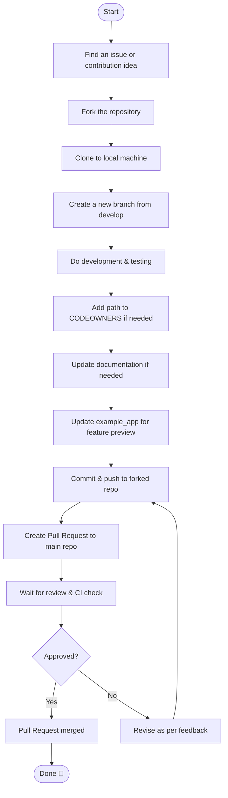

# 🚦 GitHub Contribution Workflow

This is the standard contribution workflow for this repository. Please follow these steps to ensure a smooth and collaborative contribution process.

---

## 🔄 Contribution Flow



---

---

## 📋 Detailed Steps

### 1. 🔍 Preparation

**Find Issue or Contribution Idea**
- Check available [Issues](https://github.com/ryanaidilp/stadata_flutter_sdk/issues)
- Look for [`good first issue`](https://github.com/ryanaidilp/stadata_flutter_sdk/labels/good%20first%20issue) label for beginners
- Or create a new issue for your idea

### 2. 🍴 Repository Setup

**Fork and Clone**
```bash
# Fork repository on GitHub, then clone
git clone https://github.com/your-username/stadata_flutter_sdk.git
cd stadata_flutter_sdk

# Add upstream remote
git remote add upstream https://github.com/ryanaidilp/stadata_flutter_sdk.git
```

### 3. 🌿 Branching

**Create New Branch**
```bash
# Update develop branch
git checkout develop
git pull upstream develop

# Create new feature branch
git checkout -b feature/your-feature-name
```

**Branch Naming Convention:**
- `feature/feature-name` - for new features
- `fix/bug-name` - for bug fixes
- `docs/topic` - for documentation updates
- `test/test-name` - for adding tests

### 4. 🛠️ Development

**Make Changes**
- Follow [Feature Development Workflow](FEATURE_DEVELOPMENT_WORKFLOW_EN.md)
- Ensure code follows [Clean Architecture](CLAUDE.md)
- Write tests for every change
- Update example app if needed

**Local Testing**
```bash
# Run all tests
melos test

# Format code
melos format

# Analyze code
melos analyze

# Build example app
cd app/example && flutter build apk --debug
```

### 5. 📝 Documentation

**Update Documentation**
- Update README.md if changing API
- Update CLAUDE.md for architecture changes
- Add entry to CHANGELOG.md
- Update example app for new feature demo

### 6. 🔄 Submit Changes

**Commit and Push**
```bash
# Stage changes
git add .

# Commit with clear message
git commit -m "feat: add census dataset feature with localization

- Implement CensusDataset entity and repository
- Add controller and view with GetX
- Extract strings to localization files
- Update example app with complete UI"

# Push to fork
git push origin feature/your-feature-name
```

**Commit Message Convention:**
- `feat:` - new feature
- `fix:` - bug fix
- `docs:` - documentation changes
- `style:` - formatting, semicolons, etc.
- `refactor:` - code refactoring
- `test:` - adding tests
- `chore:` - maintenance tasks

### 7. 🔀 Pull Request

**Create PR on GitHub**
1. Open your fork repository on GitHub
2. Click "Compare & pull request"
3. Choose base: `develop` ← compare: `feature/your-feature-name`
4. Fill PR template completely:

```markdown
## 📋 Description
Brief description of changes...

## 🔗 Related Issues
Closes #123

## ✅ Checklist
- [x] Tests added/updated
- [x] Documentation updated
- [x] Example app updated
- [x] CHANGELOG.md updated

## 📱 Screenshots (if UI changes)
 

## 🧪 Testing
- [ ] Unit tests pass
- [ ] Integration tests pass
- [ ] Manual testing completed
```

### 8. 👀 Review Process

**Waiting for Review**
- CI/CD will automatically check your code
- Maintainer will review within 1-3 business days
- Follow feedback and make revisions if needed

**Addressing Review Feedback**
```bash
# Make requested changes
git add .
git commit -m "fix: address review feedback"
git push origin feature/your-feature-name
```

---

## 📌 Contribution Tips

### ✅ Do's
- **Discuss big ideas** before coding
- **Write tests** for every change
- **Update relevant documentation**
- **Follow existing coding standards**
- **Make clear commit messages**
- **Respond to feedback** quickly

### ❌ Don'ts
- Don't make large PRs without discussion
- Don't skip testing
- Don't force push to main/develop
- Don't ignore linting errors
- Don't commit commented-out code

### 🎯 Best Practices

1. **Keep PRs Small**: Focus on one feature/bug per PR
2. **Write Tests**: Minimum 80% coverage for new code
3. **Document Changes**: Update README and inline docs
4. **Follow Conventions**: Follow existing patterns
5. **Be Responsive**: Respond to feedback within 2-3 days

---

## 🆘 Need Help?

- 💬 **Discussion**: Use [GitHub Discussions](https://github.com/ryanaidilp/stadata_flutter_sdk/discussions)
- 🐛 **Bug Report**: Create an [Issue](https://github.com/ryanaidilp/stadata_flutter_sdk/issues/new/choose)
- 📧 **Contact**: Mention @ryanaidilp in issues or PRs

---

Happy contributing! 🚀

Every contribution you make, no matter how small, is valuable to the community! 💝
