# 🚦 GitHub Contribution Workflow

This is the standard contribution workflow for this repository. Please follow these steps to ensure a smooth and collaborative contribution process.

---

## 🔄 Contribution Flow

```mermaid
flowchart TD
    A([Start])
    B[Find an issue or contribution idea]
    C[Fork the repository]
    D[Clone to local machine]
    E[Create a new branch from develop]
    F[Do development & testing]
    G[Add path to CODEOWNERS if needed]
    H[Update documentation if needed]
    I[Update example_app for feature preview]
    J[Commit & push to forked repo]
    K[Create Pull Request to main repo]
    L[Wait for review & CI check]
    M{Approved?}
    N[Pull Request merged]
    O[Revise as per feedback]
    P([Done 🎉])

    A --> B
    B --> C
    C --> D
    D --> E
    E --> F
    F --> G
    G --> H
    H --> I
    I --> J
    J --> K
    K --> L
    L --> M
    M -- Yes --> N
    N --> P
    M -- No --> O
    O --> J
```

---

## 📌 Contribution Tips

- Discuss your issue/idea before starting work.
- Always branch from `develop` and keep it up-to-date.
- Update documentation & example app if the feature changes behavior.
- Include tests for every change.
- Ensure the CI pipeline passes before requesting review.
- Revise your PR if you receive feedback from reviewers.

Happy contributing! 🚀
